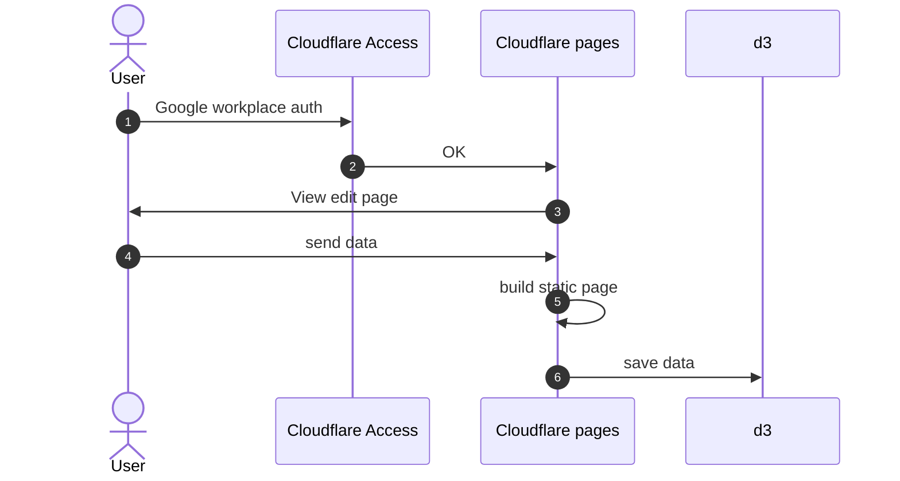
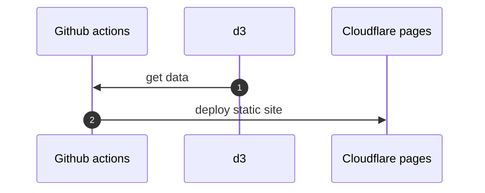

<p align="center">
  <a href="https://nextjs.org">
    <h1 align="center">CF Stack</h1>
  </a>
</p>

# documents

[storybook](https://casaub0n.github.io/cfstack/)

## Getting Started

This software neeed [yarn](https://yarnpkg.com/ "Home | Yarn - Package Manager") and [Node.js](https://nodejs.org/en/ "Node.js") to build.

```console
$ yarn install
$ yarn build
```

You have to need these environment secrets:

- CLOUDFLARE_ACCOUNT_ID
- CLOUDFLARE_API_TOKEN
- TURBO_TEAM
- TURBO_TOKEN
  in Action sercrets(https://github.com/someone/cfstack/settings/secrets/actions) for your GitHub Actions.

### How to get CLOUDFLARE_ACCOUNT_ID and CLOUDFLARE_API_TOKEN

Follow this link https://zenn.dev/nwtgck/articles/1fdee0e84e5808

### How to get TURBO_TEAM and URBO_TOKEN

Follow this link https://turborepo.org/docs/ci/github-actions

### How to use local cache to build

If you neet local cache:

```console
$ yarn turbo login
$ yarn turbo link
```

# RFC

new site generator

- Deno
- Fresh

## edit diagram



## build process on GitHub


