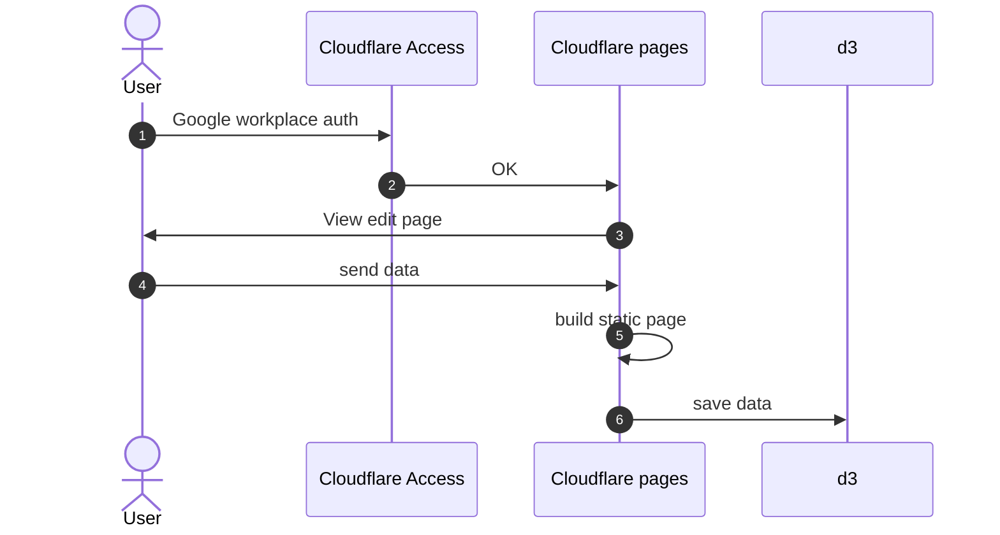
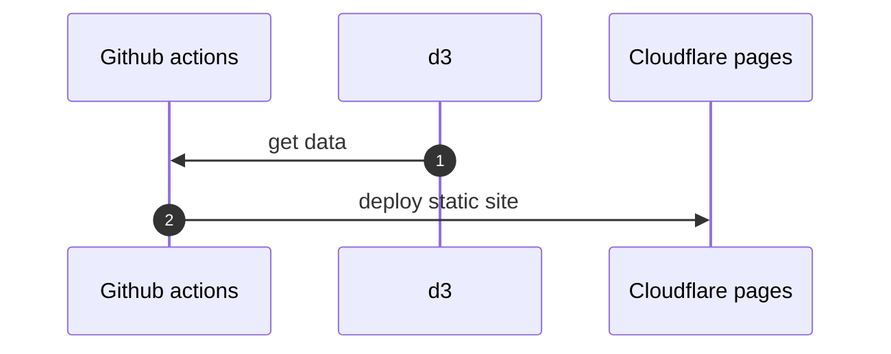

<p align="center">
  <a href="https://nextjs.org">
    <h1 align="center">CF Stack</h1>
  </a>
</p>

This repository is the ideal monorepo for next.js

I follow these technical stacks:

- [Turborepo](https://turbo.build/repo)
- [Prettier](https://prettier.io/)
- [ESLint](https://eslint.org/)
- [Jest](https://jestjs.io/)
- [Storybook](https://storybook.js.org/)
- [GitHub actions](https://github.com/features/actions)
- [Work on Windows](#Windows)

# documents

[storybook](https://casaub0n.github.io/cfstack/)

## Windows

### Update powershell

[Windows への PowerShell のインストール](https://learn.microsoft.com/ja-jp/powershell/scripting/install/installing-powershell-on-windows?view=powershell-7.3)

This is by using winget

```console
$ winget search Microsoft.PowerShell
$ winget install --id Microsoft.Powershell --source winget

```

### Scoop

Scoop is the best package manager for Windows.
In this section, installed:

- Scoop
- Git
- fnm
- Node.js
- pnpm

````console
$ Set-ExecutionPolicy RemoteSigned -Scope CurrentUser # Optional: Needed to run a remote script the first time
$ irm get.scoop.sh | iex
$ scoop bucket add main
$ scoop install main/git
$ scoop install main/fnm
$ fnm install --lts
$ fnm use v18.16.0
$ scoop install main/pnpm
```

## Getting Started

pnpm and [Node.js](https://nodejs.org/en/ "Node.js") to build.

```console
$ pnpm install
$ pnpm build
````

environment secrets:

- CLOUDFLARE_ACCOUNT_ID
- CLOUDFLARE_API_TOKEN
- TURBO_TEAM
- TURBO_TOKEN
  in Action sercrets(https://github.com/someone/cfstack/settings/secrets/actions) for your GitHub Actions.

### CLOUDFLARE_ACCOUNT_ID and CLOUDFLARE_API_TOKEN

https://zenn.dev/nwtgck/articles/1fdee0e84e5808

### TURBO_TEAM and TURBO_TOKEN

https://turborepo.org/docs/ci/github-actions

### local cache to build

```console
$ pnpm turbo login
$ pnpm turbo link
```

# RFC

new site generator

- Deno
- Fresh

## edit diagram



## build process on GitHub


