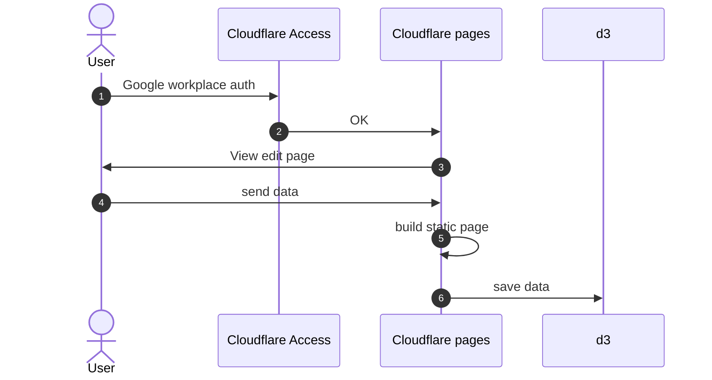
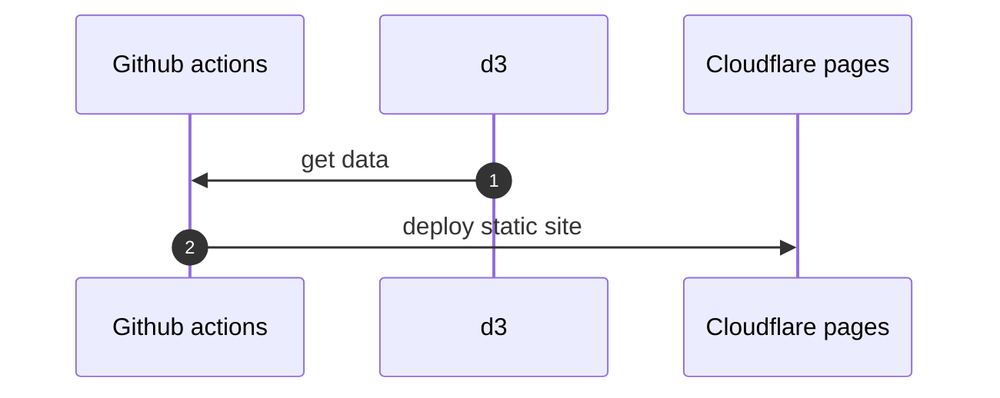

# RFC

new site generator

- Deno
- Fresh

## edit diagram

```mermaid
sequenceDiagram
    autonumber
    actor User
    participant cfa as Cloudflare Access
    participant cp as Cloudflare pages
    participant d3
    User->>cfa: Google workplace auth
    cfa->>cp: OK
    cp->>User: View edit page
    User->>cp: send data
    cp->>cp: build static page
    cp->>d3: save data
```

## build process on GitHub

```mermaid
sequenceDiagram
    autonumber
    participant gha as Github actions
    participant d3
    participant cp as Cloudflare pages
    d3->>gha: get data
    gha->>cp: deploy static site
```
